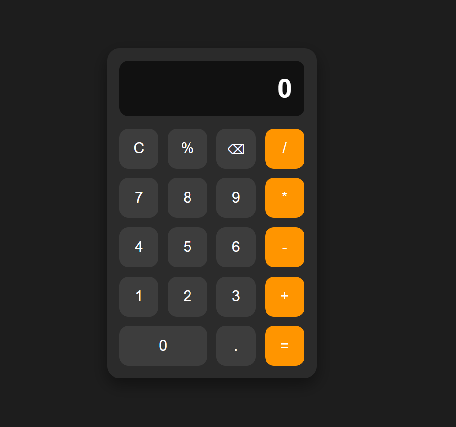

# CSS Daily Task 04 - Calculator User Interface

## 📌 Description
Created and styled a modern Calculator User Interface using HTML5 and CSS3.

This project focuses on designing a clean and responsive calculator layout using CSS Grid, Flexbox, and modern UI styling techniques without using JavaScript.

---

## 🛠️ Technologies Used
- HTML5
- CSS3

---

## 📚 CSS Concepts Covered
- External CSS
- CSS Selectors
- CSS Grid
- Flexbox
- Background Colors
- Text Styling
- Borders
- Border Radius
- Margin and Padding
- Box Model
- Button Styling
- Hover Effects
- Active Effects
- Responsive Layout
- Display Alignment

---

## ✨ Features
- Modern Calculator UI
- Responsive Design
- Large Display Screen
- Numeric Buttons
- Operator Buttons
- Clear Button
- Backspace Button
- Percentage Button
- Equal Button
- Double Width Zero Button
- Hover Animation
- Click (Active) Animation
- Clean Dark Theme Interface

---

## 📁 Project Structure

```
css-task-04/
│
├── index.html
├── style.css
├── screenshot.png
└── README.md
```

---

## 📸 Output Screenshot



---

## 🎯 Learning Outcome

This task helped me understand how to build a calculator layout using HTML and CSS. I practiced CSS Grid for arranging buttons, Flexbox for alignment, the CSS Box Model, spacing techniques, button styling, hover effects, and responsive UI design.

---

## ⚠️ Note

This is an educational practice project created for learning HTML and CSS. The calculator interface is designed only for UI practice and does not perform calculations because JavaScript has not been implemented.